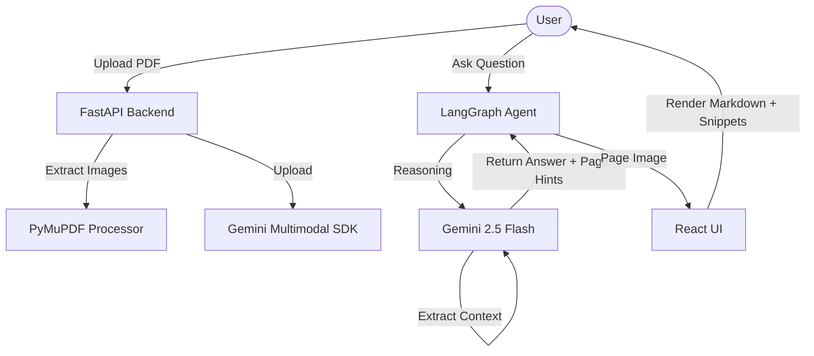

# 📄 AGENTIC-PDF: Multimodal Chat Companion

✨ **Transform your PDFs into interactive conversations.** Powered by **Gemini 2.5 Flash** and **LangGraph**, this agentic RAG system understands text, complex tables, and intricate diagrams within your documents.

---

## 🚀 Key Features

- 🧠 **Agentic Reasoning**: Uses LangGraph to orchestrate complex reasoning over multi-page documents.
- 🖼️ **Multimodal Vision**: Native support for analyzing images and charts directly within your PDFs.
- 📸 **Visual Snippets**: Automatically extracts and displays relevant PDF sections in the chat UI when you ask about tables or images.
- 💎 **Premium UI**: Sleek, glassmorphic interface built with React, Framer Motion, and Tailwind-inspired aesthetics.
- ⚡ **High Performance**: Powered by the latest Gemini 2.5 Flash for lightning-fast, intelligent responses.

---

## 🏗️ Architecture



---

## 🛠️ Tech Stack

| Layer | Technology |
| :--- | :--- |
| **LLM** | Google Gemini 2.5 Flash |
| **Orchestration** | LangChain / LangGraph |
| **Backend** | Python / FastAPI |
| **PDF Engine** | PyMuPDF (fitz) |
| **Frontend** | React / Vite / Framer Motion |
| **Styling** | Vanilla CSS (Glassmorphism) |

---

## 🚥 Getting Started

### 1. Prerequisites
- Python 3.9+
- Node.js & npm
- Gemini API Key ([Get one here](https://aistudio.google.com/))

### 2. Backend Setup
```bash
cd server
python -m venv venv
.\venv\Scripts\activate
pip install -r requirements.txt
```
Create a `.env` file in the `server` directory:
```env
GOOGLE_API_KEY=your_api_key_here
```

### 3. Frontend Setup
```bash
cd frontend
npm install
```

### 4. Running the App
From the root directory, simply run:
```powershell
.\run.ps1
```

---

## 📸 Screenshots & Usage

| Upload & Analyze | Interactive Visuals |
| :--- | :--- |
| Drop any PDF (Technical Papers, Manuals, Invoices). | Ask "Explain the diagram on page 2" to see snippets! |

---

## 🤝 Project Structure

- `server/`: FastAPI backend, Gemini processor, and LangGraph agent logic.
- `frontend/`: React source code with glassmorphic UI components.
- `uploads/`: Temporary storage for local PDF processing (auto-managed).

---

Built with ❤️ using Gemini 2.5 Flash.
